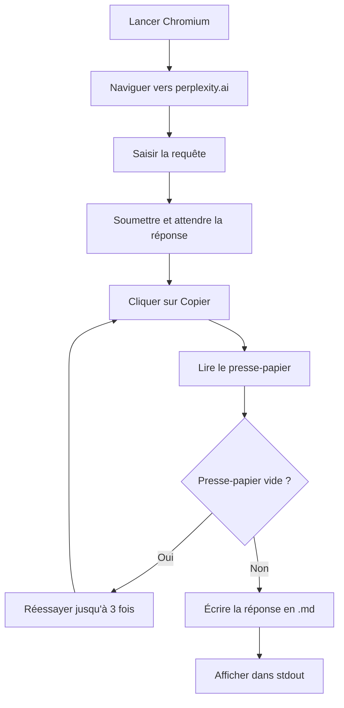

<div align="center">

<a id="readme-top"></a>

<p align="center">
  
</p>

[](https://github.com/Sofian-bll/pplx-web-query/blob/main/LICENSE)
[](https://github.com/Sofian-bll/pplx-web-query/releases)
[](https://github.com/Sofian-bll/pplx-web-query/stargazers)

</div>

<h1 align="center">Perplexity WebUI Search</h1>

<p align="center">
  Une Agent Skill portable qui interroge Perplexity via son interface web en utilisant l'automatisation Playwright — sans clé API.
</p>

> [Read in English](README.md) | [Lire en Français](README.fr.md)

<details open>
<summary>Table des matières</summary>

- [C'est quoi ?](#cest-quoi-)
- [Fonctionnalités](#fonctionnalités)
- [Prérequis](#prérequis)
- [Comment ça marche](#comment-ça-marche)
- [Démarrage rapide](#démarrage-rapide)
- [Utilisation](#utilisation)
- [Format de sortie](#format-de-sortie)
- [Structure du projet](#structure-du-projet)
- [Technologies](#technologies)
- [Contribuer](#contribuer)
- [Licence](#licence)

</details>

## C'est quoi ?

Une Agent Skill universelle qui permet à n'importe quel agent de code IA (OpenCode, Claude Code, Codex CLI) d'effectuer des recherches web via l'interface de Perplexity. Elle ouvre Chromium, navigue vers perplexity.ai, soumet une requête, capture la réponse générée et l'écrit dans un fichier Markdown.

Pas de clé API. Pas d'abonnement. Juste de l'automatisation navigateur.

<p align="right">(<a href="#readme-top">retour en haut</a>)</p>

## Fonctionnalités

- **Automatisation navigateur** — Lance Chromium, navigue sur Perplexity, soumet des requêtes
- **Extraction des réponses** — Clique sur "Copier" dans la réponse générée, lit le presse-papier
- **Logique de retry** — Gère les presse-papiers vides, réponses lentes et échecs transitoires (3 tentatives)
- **Sortie Markdown** — Sauvegarde les réponses en fichiers `.md` avec une mise en forme propre
- **Support multi-agents** — Fonctionne avec OpenCode, Claude Code et Codex CLI
- **Logs propres** — Stderr pour les logs, stdout pour la sortie — compatible pipe

<p align="right">(<a href="#readme-top">retour en haut</a>)</p>

## Prérequis

- [Node.js](https://nodejs.org/) >= 18
- Navigateurs Chromium pour Playwright

<p align="right">(<a href="#readme-top">retour en haut</a>)</p>

## Comment ça marche



<p align="right">(<a href="#readme-top">retour en haut</a>)</p>

## Démarrage rapide

```bash
cd skills/perplexity-webui-search
npm install
npx playwright install chromium
npm run search -- "Quelles sont les dernières nouveautés Playwright ?" ./result.md
```

La commande ouvre Chromium, envoie le prompt à Perplexity, copie la réponse, la sauvegarde dans `result.md` et l'affiche dans stdout.

<p align="right">(<a href="#readme-top">retour en haut</a>)</p>

## Utilisation

### En tant qu'Agent Skill

Installez dans le répertoire de skills de votre agent :

**OpenCode :**

```bash
npx skills add ./skills --skill perplexity-webui-search --agent opencode --copy
```

Ou copiez `skills/perplexity-webui-search/` dans `~/.config/opencode/skills/`.

**Codex CLI :**

```bash
npx skills add ./skills --skill perplexity-webui-search --agent codex --copy
```

**Claude Code et autres :**

Copiez `skills/perplexity-webui-search/` dans le répertoire de skills de votre agent.

### CLI directe

Depuis le répertoire du skill :

```bash
node scripts/perplexity-query.js "votre requête" ./output.md
```

### Vérifications

```bash
npm test              # Lancer les tests unitaires
npm run check         # Validation syntaxique
npm run pack:dry-run  # Vérifier le package avant publication
```

<p align="right">(<a href="#readme-top">retour en haut</a>)</p>

## Format de sortie

Les réponses sont sauvegardées en Markdown brut avec la mise en forme préservée de Perplexity. Le contenu du presse-papier est écrit tel quel dans le fichier de sortie.

```bash
npm run search -- "C'est quoi Rust ?" ./rust-apercu.md
# → rust-apercu.md contient la réponse complète de Perplexity
```

<p align="right">(<a href="#readme-top">retour en haut</a>)</p>

## Structure du projet

```text
skills/
  perplexity-webui-search/
    scripts/
      perplexity-core.js         # Cœur : args, retry, automatisation Playwright
      perplexity-core.test.mjs   # Tests unitaires
      perplexity-query.js         # Point d'entrée CLI
    references/
      install-opencode.md
      install-codex.md
      install-claude.md
      troubleshooting.md
    LICENSE
    README.md
    SKILL.md
    package.json
docs/
  assets/
    logo.png
.env
.gitignore
LICENSE
README.md
README.fr.md
```

<p align="right">(<a href="#readme-top">retour en haut</a>)</p>

## Technologies


<p align="right">(<a href="#readme-top">retour en haut</a>)</p>

## Contribuer

Les contributions sont les bienvenues. Ce projet est public — forkez, créez une branche et ouvrez une PR.

1. Forkez le repo
2. Créez une branche (`git checkout -b feat/fonctionnalite`)
3. Committez vos changements (`git commit -m "feat: ajout fonctionnalité"`)
4. Poussez (`git push origin feat/fonctionnalite`)
5. Ouvrez une Pull Request

<a href="https://github.com/Sofian-bll/pplx-web-query/graphs/contributors">
  
</a>

<p align="right">(<a href="#readme-top">retour en haut</a>)</p>

## Licence

Distribué sous licence MIT. Voir [`LICENSE`](LICENSE) pour plus d'informations.

<p align="right">(<a href="#readme-top">retour en haut</a>)</p>

---

<div align="center">

[](https://star-history.com/#Sofian-bll/pplx-web-query&Date)

</div>

<!-- REFERENCE_LINKS -->
[node.js]: https://nodejs.org/
[playwright]: https://playwright.dev/
