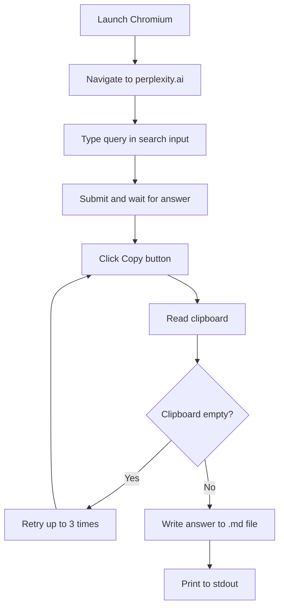

<div align="center">

<a id="readme-top"></a>

<p align="center">
  
</p>

[![License][license-shield]][license-url]
[![Release][release-shield]][release-url]
[![Stars][stars-shield]][stars-url]

</div>

<h1 align="center">Perplexity WebUI Search</h1>

<p align="center">
  A portable Agent Skill that queries Perplexity through its web UI using Playwright browser automation — no API key required.
</p>

> [Read in English](README.md) | [Lire en Français](README.fr.md)

<details open>
<summary>Table of Contents</summary>

- [What is this?](#what-is-this)
- [Features](#features)
- [How It Works](#how-it-works)
- [Built With](#built-with)
- [Quick Start](#quick-start)
- [Usage](#usage)
- [Project Structure](#project-structure)
- [Documentation](#documentation)
- [Contributing](#contributing)
- [License](#license)

</details>

## What is this?

A universal Agent Skill that enables any AI coding agent — OpenCode, Claude Code, Codex CLI — to perform web searches through Perplexity's interface. It launches Chromium, navigates to perplexity.ai, submits a query, captures the generated answer from the clipboard, and writes it to a Markdown file.

No API key. No subscription. Just browser automation.

<p align="right">(<a href="#readme-top">back to top</a>)</p>

## Features

- **Browser automation** — Launches Chromium, navigates Perplexity, submits queries
- **Answer extraction** — Clicks "Copy" on the generated response, reads from clipboard
- **Retry logic** — Handles empty clipboard, slow responses, and transient failures (3 retries)
- **Markdown output** — Saves answers as `.md` files preserving Perplexity's formatting
- **Multi-agent** — Works with OpenCode, Claude Code, and Codex CLI out of the box
- **Clean I/O** — Stderr for logs, stdout for output — pipe-friendly

<p align="right">(<a href="#readme-top">back to top</a>)</p>

## How It Works



<p align="right">(<a href="#readme-top">back to top</a>)</p>

## Built With

[![Node.js][nodejs-shield]][nodejs-url]
[![Playwright][playwright-shield]][playwright-url]
[![Git][git-shield]][git-url]

<p align="right">(<a href="#readme-top">back to top</a>)</p>

## Quick Start

**Prerequisites:** [Node.js][nodejs-url] >= 18 and Chromium browsers.

```bash
cd skills/perplexity-webui-search
npm install
npx playwright install chromium
npm run search -- "What are the latest Playwright changes?" ./result.md
```

The command opens Chromium, sends the prompt to Perplexity, copies the answer, saves it to `result.md`, and prints it to stdout.

<p align="right">(<a href="#readme-top">back to top</a>)</p>

## Usage

### As an Agent Skill

Install into your agent's skill directory:

**OpenCode:**

```bash
npx skills add ./skills --skill perplexity-webui-search --agent opencode --copy
```

Or copy `skills/perplexity-webui-search/` into `~/.config/opencode/skills/`.

**Codex CLI:**

```bash
npx skills add ./skills --skill perplexity-webui-search --agent codex --copy
```

**Claude Code and others:**

Copy `skills/perplexity-webui-search/` into your agent's skills directory.

### Direct CLI

```bash
node scripts/perplexity-query.js "your query" ./output.md
```

### Output

Answers are saved as plain Markdown. Perplexity's formatting is preserved verbatim from the clipboard.

```bash
npm run search -- "What is Rust?" ./rust-overview.md
# → rust-overview.md contains the full Perplexity answer
```

### Checks

```bash
npm test              # Unit tests
npm run check         # Syntax validation
npm run pack:dry-run  # Verify publish-ready package
```

<p align="right">(<a href="#readme-top">back to top</a>)</p>

## Project Structure

```text
skills/
  perplexity-webui-search/
    scripts/
      perplexity-core.js         # Core: args, retry, Playwright automation
      perplexity-core.test.mjs   # Unit tests
      perplexity-query.js        # CLI entry point
    references/
      install-opencode.md
      install-codex.md
      install-claude.md
      troubleshooting.md
    LICENSE
    README.md
    SKILL.md
    package.json
docs/
  assets/
    logo.png
.gitignore
LICENSE
README.md
README.fr.md
```

<p align="right">(<a href="#readme-top">back to top</a>)</p>

## Documentation

| Document | Description |
|----------|-------------|
| [Install — OpenCode](skills/perplexity-webui-search/references/install-opencode.md) | Setup guide for OpenCode users |
| [Install — Codex CLI](skills/perplexity-webui-search/references/install-codex.md) | Setup guide for Codex CLI users |
| [Install — Claude Code](skills/perplexity-webui-search/references/install-claude.md) | Setup guide for Claude Code / compatible agents |
| [Troubleshooting](skills/perplexity-webui-search/references/troubleshooting.md) | Common issues and solutions |
| [Skill Spec](skills/perplexity-webui-search/SKILL.md) | Agent skill manifest and schema |
| [Tests](skills/perplexity-webui-search/scripts/perplexity-core.test.mjs) | Unit test suite (arg parsing, retry logic, clipboard) |

<p align="right">(<a href="#readme-top">back to top</a>)</p>

## Contributing

Contributions are welcome. This is a public project — fork, branch, and open a PR.

1. Fork the repo
2. Create a feature branch (`git checkout -b feat/amazing-feature`)
3. Commit your changes (`git commit -m "feat: add amazing feature"`)
4. Push to the branch (`git push origin feat/amazing-feature`)
5. Open a Pull Request

<a href="https://github.com/Sofian-bll/pplx-web-query/graphs/contributors">
  
</a>

<p align="right">(<a href="#readme-top">back to top</a>)</p>

## License

Distributed under the MIT License. See [`LICENSE`](LICENSE) for more information.

<p align="right">(<a href="#readme-top">back to top</a>)</p>

---

<div align="center">

[![Star History Chart][star-history]][star-history-url]

</div>

<!-- REFERENCE_LINKS -->
[license-shield]: https://img.shields.io/github/license/Sofian-bll/pplx-web-query?style=flat
[license-url]: https://github.com/Sofian-bll/pplx-web-query/blob/main/LICENSE
[release-shield]: https://img.shields.io/github/v/release/Sofian-bll/pplx-web-query?style=flat
[release-url]: https://github.com/Sofian-bll/pplx-web-query/releases
[stars-shield]: https://img.shields.io/github/stars/Sofian-bll/pplx-web-query?style=flat
[stars-url]: https://github.com/Sofian-bll/pplx-web-query/stargazers
[nodejs-shield]: https://img.shields.io/badge/node.js-6DA55F?style=flat&logo=node.js&logoColor=white
[nodejs-url]: https://nodejs.org/
[playwright-shield]: https://img.shields.io/badge/playwright-%2345ba4b?style=flat&logo=playwright&logoColor=white
[playwright-url]: https://playwright.dev/
[git-shield]: https://img.shields.io/badge/git-%23F05033.svg?style=flat&logo=git&logoColor=white
[git-url]: https://git-scm.com/
[star-history]: https://api.star-history.com/svg?repos=Sofian-bll/pplx-web-query&type=Date
[star-history-url]: https://star-history.com/#Sofian-bll/pplx-web-query&Date
